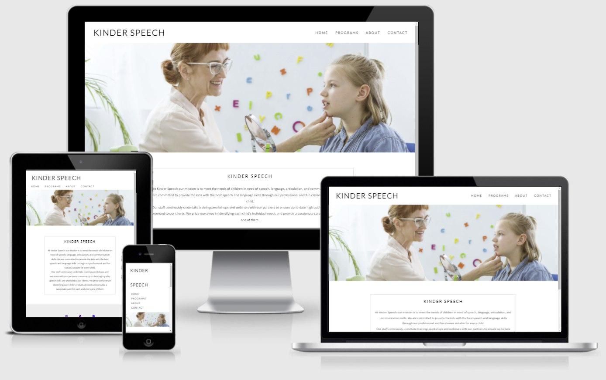

 
# KINDER SPEECH
Kinder Speech website is designed for parents with children in need of speech, language, articulation, and communication skills which includes Autism Spectrum Disorder,Cerebral Palsy,Autism Spectrum Disorder.
On this website, I also stated the type of programs that Kinder Speech offers to their clients.

[Link to live website](https://pauline-rugwevera.github.io/kinder-speech/)
# UX
## User Stories
### New users
* As a first time user of the site, I want to easily tell the mission and purpose of the site.
* As a first time user of the site, I want to easily navigate the site
* As a first time user of the site, I want to read about the programs being offered
* As a first time user of the site, I want to visit the site's social media links and find out about their following and what other users are saying about them.
### Returning users
* As a returning user I would want to find out if there is a testimonial section

## Features
* The site features a navigation bar making it easier to navigate to any page. The right side clearly shows to the user the name of the site while Home, Programs, About, Contact apperas to the right of the navigation bar
* The website features a mission section that states to the users the soul purpose of the site as well as the target audience.
* A footer that contains social media links for users who would want to follow on social media
* A programs page with all programs and full description of each
* An about page that tells the users the purpose of the site and what they get in return as well as location.
* A contact form where users can fill in their details and message should they have something to ask or feedback
### Future Features
* Testimonial page where users can provide testimonies of the services
## Technologies
HTML

CSS

Github

Github pages

Gitpod

Google fonts

Font awesome

