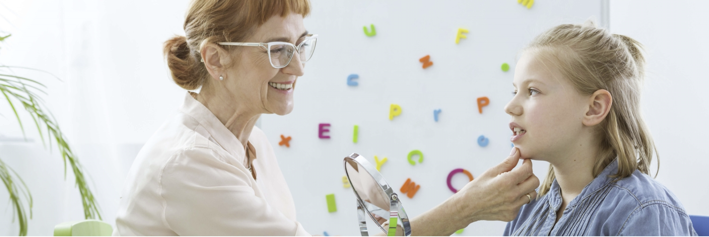

# KINDER SPEECH
The site presents Kinder Speech as a Speech and language programs for children. Kinder Speech is designed for parents with children in need of speech, language, articulation, and communication skills which includes Autism Spectrum Disorder,Cerebral Palsy,Autism Spectrum Disorder.

It has to be noted that this site was developed for educational purposes only.

# Table of contents
* [UX](#ux)
  - [Site owner's goals](#site-owner's-goals)
  - [User goals](#user-goals)
    - [New user goals](#new-user-goals)
    - [Returning user goals](#returning-user-goals)
  - [User stories](#user-stories)
    - [New users](#new-users)
    - [Returning user](#returning-user)
  - [Surface](#surface)
    - [Colors](#colors)
    - [Fonts](#fonts)
* [Features](#features)
  - [Navigation bar](#navigation-bar)
  - [Home](#home)
  - [Programs](#programs)
  - [About](#about)
  - [Contact](#contact)
  - [Footer](#footer)
* [Technologies](#technologies)
* [Testing](#testing)
  - [Functionality](#functionality)
  - [Compatibilty](#compatibilty)
  - [User stories Testing](#user-stories-testing)
  - [Bugs](#bugs)
  - [Validator Testing](#validator-testing)
* [Deployment](#deployment)
* [Credits](#credits)

[Link to live website](https://pauline-rugwevera.github.io/kinder-speech/)
# UX
## Site owner's goals
* To present speech and language programs for children to the public and how it improves them to speak, the manner of the classes as well as how equipped the staff is. 
* Users to easily navigate the site.
* Connect with all the customers including the potential ones.
* Make sure users find it easy to ask any  questions or give feedback.
## User goals
### New user goals
* User is able to find more information about the speech and language site.
* User is able to easily find each program description, in detail.
* User is able to find how exactly these programs help them.
* User can easily contact the owner
### Returning user goals
* User can find the classes' timetable.
* User can find the resources used in class.
## User Stories
### New users
* As a first time user of the site, I want to easily tell the mission and purpose of the site.
* As a first time user of the site, I want to easily navigate the site
* As a first time user of the site, I want to read about the programs being offered
* As a first time user of the site, I want to visit the site's social media links and find out about their following and what other users are saying about them.
### Returning users
* As a returning user I would want to find out if there is a testimonial section.
* As a returning user I would want to find a timetable for the classes.
* As a returning user I would want to find the exact address in case I need to direct someone.
## Surface
### Colors
Colors used in this project are:
* font color: #000
* background color: #D8E3E7
* footer background color: #EDEDED
* hoover color: #D8E3E7
* button color: #ffffff
### Fonts
* LATO was used for the header
* Open Sans for main content and sans-serif for backup

[Back to Table of contents](#table-of-contents)

# Features
This site consists of 6 pages. 4 of these can be accessed using the navigation, the other 2 are 404 error page and submission confirmation page. The following are the features found on the site:
### Navigation bar
 The navigation bar feature makes it easier to navigate to any page.The left side shows the logo of the site that can as well be used as a way to navigate to the home page. The right side shows other menu links or pages a user can access.
 #### Navigation
 * Left site of the navigation bar contains a logo a user can use to navigate to the home page
 * The right side consists of 4 page links  which are:
   - Home
   - Programs
   - About
   - Contact

### Home
* Hero image
  - Entails the soul purpose of the site

* Mission
  - The website features a mission section that states to the users the soul purpose of the site as well as the target audience.The manner in which classes are conducted and how the staff is equipped.
 

## Programs
* A programs page with all programs offered and full description of each.
* Shows three images that describes the type of the program, with a detailed description.
* Each program clearly shows how it benefits the clients.

## About
* The about page gives users more information about Kinder Speech, specifying what it is all about, what it offers, the number of years it has existed, why it exists as well as where it is located .
* Consist of an image on the left side of the page and about information on the right side.

## Contact
* Consist of a contact form on the left side of the page and image on the right.
* The form where users can fill in their details and message should they have something to ask or give feedback.
* They will need to fill in their first and last name, email then the message they would want to send and press a submit button.

## Footer
* A footer that contains social media links for users who would want to follow or connect with the site on social media.
* It is at the bottom of every page and opens in a seperate browser.

## Future Features
* Testimonial page where users can provide testimonies of the services
* Price page
* Timetable of the classes

[Back to Table of contents](#table-of-contents)

# Technologies
 HTML
 * Used a structure language to give this site a structure

 CSS
 * Used as a style language 

 Github
 * Used as Version control

Gitpod
* Used as a platform to develop the site

Google fonts
* Used as a font library

 Font awesome
 * Used for social networks icons

 [Back to Table of contents](#table-of-contents)

# Testing
### Functionality
I used Chrome developers tools for development of this project. Responsive design and testing was also performed on Microsoft edge.
### Compatibilty
With Chrome and Microsoft edge, the following emulated devices were checked using responsive design:
- Galaxy S5
- iPhone 5/SE
- iPhone 6/7/8 Plus
- iPad
- iPad Pro
- Nest Hub max

The site was also tested on smaller hardware devices which are Samsung Tab E and Samsung A12.The header, programs, about and contact were also checked to make sure they fit well on small devices.
## User stories Testing
### Site owner
- To present speech and language programs for children to the public and how it improves them to speak, the manner of the classes as well as how equipped the staff is. 
  > Kinder means children, and the images throughout the pages shows the potential customers targeted, the mission section states the nature of the classes and that of the staff.
- Users to easily navigate the site.
  > The navigation is fixed, clear and consistency on all pages
- Connect with all the customers including the potential ones.
  > Each page contains social network links easy to find for users and consistent to all pages.
-  Make sure users find it easy to ask any questions or give feedback
   > Users can contact by filling the contact form or rather use social links.
### New user
- User is able to find more information about the speech and language site.
  > The user can easily see the mission section and about page for more information.
- User is able to easily find each program description in detail.
  > The user can easily navigate to the programs page to find each program's description
- User is able to find how exactly these programs help them.
  > Each description also state how exactly it helps a child to speak
- User can easily contact the owner.
  > The user can navigate to the contact page where they can fill their details and write a message
### Returning user
- User can find the classes' timetable.
  > User to find a page with a timetable for the classes
- User can find the resources used in class.
  > User to find supporting resources and structures that facilitates the programs

### Bugs
I encountered the following bugs while developing the website:

* The hero image was shrinking from screens 1100px wide and below.

* There was too much gap between programs and about images and text.
* The form could not perform as expected.
* There were some missing closing tags.

 However the bugs have been corrected

### Validator Testing
* HTML
  - No errors were found after validating with W3C validator except the homepage with one forgivable warning that states that there must be a section heading in the hero container section, which I actually did not intend to put. Check:
  - [Home](https://validator.w3.org/nu/?doc=https%3A%2F%2Fpauline-rugwevera.github.io%2Fkinder-speech%2Findex.html)
  - [Programs](https://validator.w3.org/nu/?doc=https%3A%2F%2Fpauline-rugwevera.github.io%2Fkinder-speech%2Fprograms.html)
  - [About](https://validator.w3.org/nu/?doc=https%3A%2F%2Fpauline-rugwevera.github.io%2Fkinder-speech%2Fabout.html)
  - [Contact](https://validator.w3.org/nu/?doc=https%3A%2F%2Fpauline-rugwevera.github.io%2Fkinder-speech%2Fcontact.html)
* CSS
  - No errors were found after checking the css with Jigsaw validator.
  

  [Back to Table of contents](#table-of-contents)

# Deployment
Kinder Speech was deployed as follows:
* Open the repository on GitHub
* Go to "Settings" (the tab on the right)
* On the left hand side select "Pages" 
* Select the "main" branch as the source. Then it shows you a green confirmation "Your site is published at......" with the URL.

[Back to Table of contents](#table-of-contents)
# Credits
### Content
The following websites were used for the research of this project:
 * https://www.interactivemetronome.com/clients-landing-page/apd
 * https://www.autismcommunity.org.au/about.html
 * http://www.speechlearn.com/programs
 * https://blog.learnfasthq.com/why-the-benefit-of-fast-forword-are-long-lasting
 * https://www.gemmlearning.com/programs/fast-forword/
 * https://advancedbrain.com/about-tlp/
 * https://www.thespeechacademy.ie/
 ### Media
 Images used in this project are from [Adobe stock](https://stock.adobe.com/ie/)
 
 Photographers in particular:
 * [Africa Studio](https://stock.adobe.com/ie/contributor/293313/africa-studio?load_type=author&prev_url=detail)
 * [Photographee.eu](https://stock.adobe.com/ie/contributor/200793652/photographee-eu?load_type=author&prev_url=detail)
 * [alexeytsurkan](https://stock.adobe.com/ie/Library/urn:aaid:sc:EU:a3255284-c0fb-428a-9496-4bc330e0c242?asset_id=233434074)
 ### Code
 * The hero image code is from [Hero image code](https://www.w3schools.com/howto/howto_css_hero_image.asp)

 * The image animations code is from [Image animations](https://www.w3schools.com/css/css3_animations.asp)

 * Social network icons style code is from [Social network icons color](https://stackoverflow.com/)

 ### Acknowledgements
 * Love Running project for step by step guidance
 * [https://tinypng.com/] for optimising of images
 * [https://www.w3schools.com/] for general understanding
 * [Codegrepper](https://www.codegrepper.com/) for general css tips and techniques
 * [CSS tricks](https://css-tricks.com/) for in depth css tricks
 * My Mentor's feedback and guidance
 
 [Back to Table of contents](#table-of-contents)

  

  

